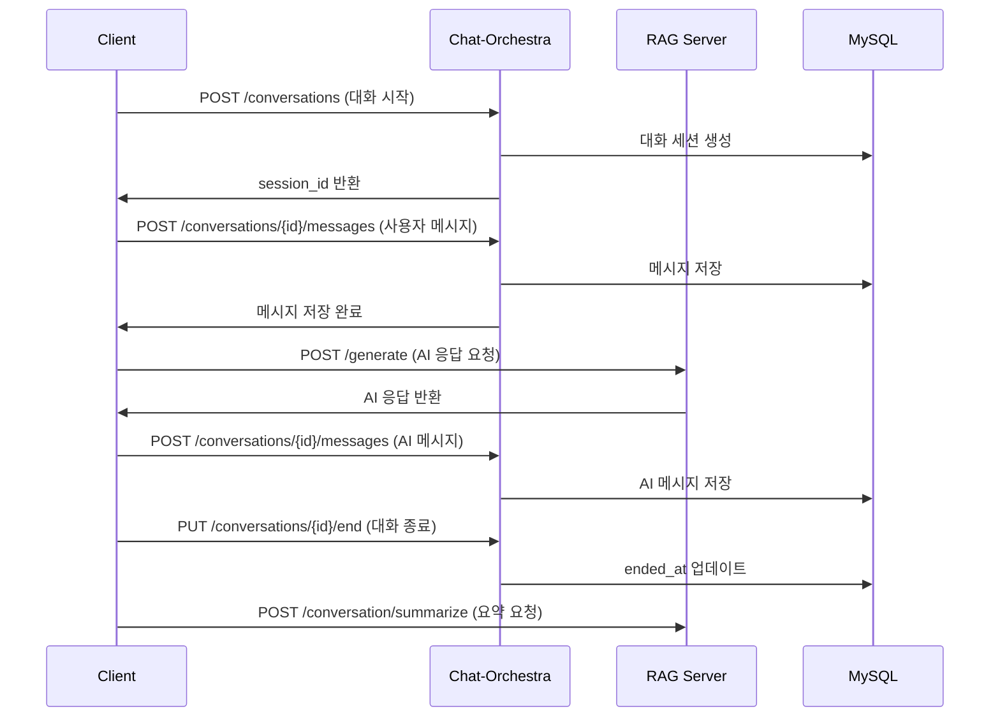

# Chat-Orchestra 🎭

> **Pure MSA 기반 대화 세션 관리 서비스**

Chat-Orchestra는 마이크로서비스 아키텍처 기반의 대화 세션 관리 전용 백엔드 서비스입니다. 
대화의 생성, 메시지 추가, 조회, 종료 등 대화 세션의 전체 생명주기를 관리하며, 
AI 응답 생성은 별도의 RAG 서버에서 처리하는 순수한 MSA 구조로 설계되었습니다.

## 🏗️ 아키텍처

```
[Frontend Client]
    ↓ REST API
[Chat-Orchestra] ────────► [MySQL Database]
    
[Frontend Client]
    ↓ Direct API Call
[RAG Server] (별도 서비스)
```

- **Chat-Orchestra**: 대화 세션 관리 (현재 프로젝트)
- **RAG Server**: AI 응답 생성 (별도 MSA 서비스)
- **Frontend**: 클라이언트가 두 서비스를 직접 호출

## 🚀 기술 스택

- **Framework**: Spring Boot 3.5.5
- **Language**: Java 17
- **Database**: MySQL 8.0
- **ORM**: JPA/Hibernate
- **Documentation**: SpringDoc OpenAPI (Swagger)
- **Build Tool**: Gradle
- **Deployment**: Azure App Service

## 📋 주요 기능

### 🎯 Core Features
- ✅ **대화 세션 생성** - 새로운 대화 시작
- ✅ **메시지 추가** - 사용자/어시스턴트 메시지 저장
- ✅ **대화 조회** - 세션별 메시지 히스토리 조회
- ✅ **대화 종료** - 세션 종료 및 타임스탬프 기록

### 🔧 Technical Features
- ✅ **RESTful API** - 표준 REST API 제공
- ✅ **데이터 검증** - Jakarta Validation 적용
- ✅ **에러 핸들링** - 통일된 에러 응답 형식
- ✅ **API 문서화** - Swagger UI 제공
- ✅ **CORS 설정** - 프론트엔드 연동 지원

## 🗄️ 데이터베이스 스키마

```sql
-- conversations 테이블
CREATE TABLE conversations (
    id BIGINT PRIMARY KEY AUTO_INCREMENT,
    started_at TIMESTAMP,
    ended_at TIMESTAMP
);

-- messages 테이블  
CREATE TABLE messages (
    id BIGINT PRIMARY KEY AUTO_INCREMENT,
    conversation_id BIGINT NOT NULL,
    speaker VARCHAR(255) NOT NULL,
    content TEXT NOT NULL,
    created_at TIMESTAMP NOT NULL,
    FOREIGN KEY (conversation_id) REFERENCES conversations(id)
);
```

## 🔌 API 엔드포인트

### 📡 Base URL
- **개발환경**: `http://localhost:8081`
- **운영환경**: `https://yerak-chat-cyfze4hnhbeaawc8.koreacentral-01.azurewebsites.net`

### 🎪 Conversation Management

#### 1. 대화 시작
```http
POST /api/conversations
```

**응답:**
```json
{
  "success": true,
  "data": {
    "session_id": 1,
    "status": "CREATED",
    "started_at": "2024-01-01T00:00:00Z"
  },
  "timestamp": "2024-01-01T00:00:00Z"
}
```

#### 2. 메시지 추가
```http
POST /api/conversations/{conversationId}/messages
Content-Type: application/json

{
  "role": "USER",
  "content": "안녕하세요!"
}
```

**응답:**
```json
{
  "success": true,
  "data": {
    "message_id": 1,
    "session_id": 1,
    "role": "USER",
    "content": "안녕하세요!",
    "created_at": "2024-01-01T00:00:00Z",
    "assistant_preview": "Mock assistant preview"
  }
}
```

#### 3. 대화 조회
```http
GET /api/conversations/{conversationId}
```

**응답:**
```json
{
  "success": true,
  "data": {
    "session_id": 1,
    "status": "ACTIVE",
    "messages": [
      {
        "message_id": 1,
        "role": "USER",
        "content": "안녕하세요!",
        "created_at": "2024-01-01T00:00:00Z"
      }
    ],
    "total": 1
  }
}
```

#### 4. 대화 종료
```http
PUT /api/conversations/{conversationId}/end
Content-Type: application/json

{
  "reason": "사용자 요청"
}
```

## 🛠️ 개발 환경 설정

### 📋 필수 요구사항
- Java 17+
- MySQL 8.0+
- Gradle 8.11+

### 🔧 환경 변수 설정
`.env` 파일 생성:
```properties
# 서버 설정
SERVER_PORT=8081

# 데이터베이스 설정
SPRING_DATASOURCE_URL=jdbc:mysql://localhost:3306/chat_orchestra
SPRING_DATASOURCE_USERNAME=your_username
SPRING_DATASOURCE_PASSWORD=your_password

# JPA 설정
SPRING_JPA_HIBERNATE_DDL_AUTO=update
JPA_SHOW_SQL=false
```

### 🚀 실행 방법

1. **저장소 클론**
```bash
git clone <repository-url>
cd chat-orchestra
```

2. **데이터베이스 생성**
```sql
CREATE DATABASE chat_orchestra;
```

3. **애플리케이션 실행**
```bash
./gradlew bootRun
```

4. **API 문서 확인**
```
http://localhost:8081/swagger-ui.html
```

## 🔍 API 문서

### 📖 Swagger UI
- **로컬**: http://localhost:8081/swagger-ui.html
- **운영**: https://yerak-chat-cyfze4hnhbeaawc8.koreacentral-01.azurewebsites.net/swagger-ui.html

### 📄 OpenAPI Spec
- **로컬**: http://localhost:8081/api-docs
- **운영**: https://yerak-chat-cyfze4hnhbeaawc8.koreacentral-01.azurewebsites.net/api-docs

## 🎭 MSA 통신 패턴

### 🔄 클라이언트 워크플로우


## 🏷️ 버전 정보

- **현재 버전**: 1.0.0-SNAPSHOT
- **Spring Boot**: 3.5.5
- **Java**: 17
- **API 버전**: v1

## 📞 문의

- **팀**: Chat-Orchestra Team
- **이메일**: support@guidely.com
- **라이선스**: MIT License

---

> 💡 **참고**: 이 서비스는 대화 세션 관리만 담당하며, AI 응답 생성은 별도의 RAG 서버에서 처리됩니다.
> 클라이언트는 필요에 따라 두 서비스를 직접 호출하여 완전한 대화 시스템을 구성할 수 있습니다.
